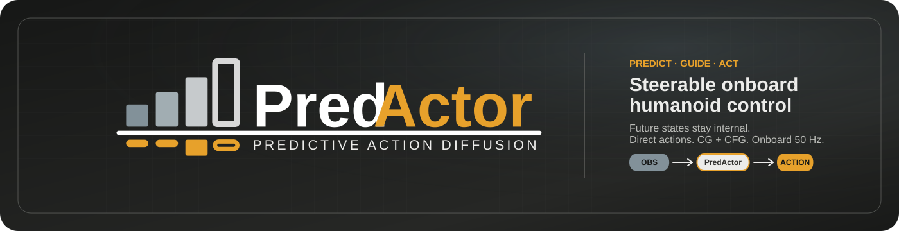

<p align="center">
  <a href="https://masteryip.github.io/predactor.github.io/">
    
  </a>
</p>

<h1 align="center">PredActor: Predictive Action Diffusion for Steerable Onboard Humanoid Control</h1>

<p align="center">
  <a href="https://masteryip.github.io/predactor.github.io/"></a>
  <a href="https://arxiv.org/abs/2609.24840"></a>
  <a href="#demos"></a>
  <a href="#quick-evaluation"></a>
  <a href="https://huggingface.co/MasterYip/PredActor_Artifacts"></a>
  <a href="LICENSE"></a>
</p>

<p align="center">
  
</p>

> [!IMPORTANT]
> The evaluation code is available now, with browser-based MuJoCo evaluation
> of the published PDP051 checkpoint. Training, data collection, and robot
> deployment releases are coming soon.

## Quick evaluation

Install [uv](https://docs.astral.sh/uv/), then run these commands on Linux:

```bash
git clone https://github.com/MasterYip/PredActor.git
cd PredActor
uv sync --locked
uv run --locked python scripts/hf_download.py --filter checkpoints
uv run --locked predactor-eval
```

The download command retrieves the released checkpoints from
[MasterYip/PredActor_Artifacts](https://huggingface.co/MasterYip/PredActor_Artifacts).

The last command opens `http://127.0.0.1:8765/`. It uses CUDA when available
and otherwise falls back to CPU. The locked environment targets Python 3.10
and includes the evaluator, MuJoCo, and the browser interface; Isaac Sim and
the training repositories are not required.

For a headless startup, use `uv run --locked predactor-eval --headless
--web-no-browser`. Run `uv run --locked predactor-eval --help` for optional
checkpoint, config, device, and Web UI overrides.

## Overview

**PredActor** augments action diffusion with an internal future-state trajectory for look-ahead guidance while retaining direct action execution. Within a joint state-action formulation, it predicts future states and actions from proprioceptive history and optional task context. Unlike a generator-tracker pipeline, predicted states remain inside the policy rather than becoming motion references for a separate tracker. Unlike action-only diffusion, the policy provides an explicit future-state trajectory for guidance.

This representation supports two complementary steering mechanisms: **classifier guidance (CG)** applies test-time objectives to predicted states, and **classifier-free guidance (CFG)** strengthens learned behavior conditions, including text commands. The selected action is sent directly to the joint controller; policy observations require only proprioception, not externally estimated full-body states.

For onboard execution, rolling denoising and computation-preserving runtime optimizations support **50 Hz control on a Unitree G1's Jetson Orin NX**. The measured complete callback takes **16.790 ms median and 19.383 ms p95**, both below the 20 ms control period. Across simulation and physical-robot evaluation, demonstrations cover text commands, disturbance response, joystick steering, and semantic interpolation.

## Project preview

<p align="center">
  <a href="https://masteryip.github.io/predactor.github.io/">
    
  </a>
</p>

### At a glance

- **Predictive direct control:** jointly predicts future states and actions, keeps states internal, and executes the selected action without a separate motion-reference tracker.
- **Proprioceptive inputs:** conditions on onboard proprioceptive history without requiring externally estimated full-body states as policy inputs.
- **CG and CFG steering:** combines test-time objectives on predicted states with learned behavior conditioning.
- **Rolling onboard inference:** reuses the denoising horizon across control ticks and optimizes runtime for 50 Hz operation on Jetson Orin NX.
- **Simulation and hardware evidence:** demonstrates commands, transitions, steering, and disturbance response.

**Release checklist**

- [x] **Evaluation:** browser-based MuJoCo evaluation, G1 assets, and published checkpoints.
- [ ] **Data collection and labeling:** motion collection, preprocessing, and dataset labeling tools.
- [ ] **BC training:** behavior-cloning training code, configurations, and reproducibility assets.
- [ ] **DAgger:** interactive data aggregation and policy refinement pipeline.
- [ ] **Deployment:** onboard deployment and hardware-control tools.

## Demos

Each result is independently playable below. Visit the
[project website](https://masteryip.github.io/predactor.github.io/#evidence)
for the complete gallery.

### Hardware

<table>
  <tr>
    <td width="50%" valign="top">
      <strong>Text control</strong><br>
      <sub>Walk, squat down, and return to walking.</sub><br>
      <video src="https://github.com/user-attachments/assets/f6c25169-5c14-49c9-9bb2-50a9151432a8" controls width="100%"></video>
    </td>
    <td width="50%" valign="top">
      <strong>Behavior transitions</strong><br>
      <sub>Walk, accelerate to a jog, and transition into a squat.</sub><br>
      <video src="https://github.com/user-attachments/assets/6cf29b10-9150-48df-8241-320124bc0b95" controls width="100%"></video>
    </td>
  </tr>
  <tr>
    <td width="50%" valign="top">
      <strong>Physical interaction</strong><br>
      <sub>Walk and stand commands under external interference.</sub><br>
      <video src="https://github.com/user-attachments/assets/f39231c8-96c7-4a8d-b239-d23ac460a5e4" controls width="100%"></video>
    </td>
    <td width="50%" valign="top">
      <strong>Outdoor pathway</strong><br>
      <sub>Outdoor locomotion on the physical G1.</sub><br>
      <video src="https://github.com/user-attachments/assets/04141756-978a-4b25-9a8f-237cfa1c7ca4" controls width="100%"></video>
    </td>
  </tr>
</table>

### Simulation

<table>
  <tr>
    <td width="50%" valign="top">
      <strong>Joystick steering</strong><br>
      <sub>Directional steering with text-selected locomotion modes.</sub><br>
      <video src="https://github.com/user-attachments/assets/f5735ad1-efa1-4036-ab3f-709727daff5b" controls width="100%"></video>
    </td>
    <td width="50%" valign="top">
      <strong>Text and joystick</strong><br>
      <sub>Text-selected behavior with simultaneous directional control.</sub><br>
      <video src="https://github.com/user-attachments/assets/909137a3-0800-43ca-a00c-18b6c40ef026" controls width="100%"></video>
    </td>
  </tr>
  <tr>
    <td width="50%" valign="top">
      <strong>Text control</strong><br>
      <sub>Behavior selection and transitions from text commands.</sub><br>
      <video src="https://github.com/user-attachments/assets/2355d8a0-aa95-4ab2-a45f-3bc75c4f46a9" controls width="100%"></video>
    </td>
    <td width="50%" valign="top">
      <strong>Semantic interpolation</strong><br>
      <sub>Continuous control between semantic motion endpoints.</sub><br>
      <video src="https://github.com/user-attachments/assets/9e5e946b-ea85-479d-9d83-70b9a7a5012c" controls width="100%"></video>
    </td>
  </tr>
  <tr>
    <td width="50%" valign="top">
      <strong>Target tracking</strong><br>
      <sub>Classifier-guided destination following.</sub><br>
      <video src="https://github.com/user-attachments/assets/5d2b4f99-d7cf-42b3-ab70-202e107910fc" controls width="100%"></video>
    </td>
    <td width="50%" valign="top">
      <strong>Disturbance response</strong><br>
      <sub>Recovery behavior under external perturbations.</sub><br>
      <video src="https://github.com/user-attachments/assets/4752669d-dcc1-481b-8b8f-c40b8f5c2fd9" controls width="100%"></video>
    </td>
  </tr>
</table>

## Acknowledgements

We thank the authors of the following open-source projects:

- [diffusion_implementation](https://github.com/WhoKnowsssss/diffusion_implementation) by WhoKnowsssss, which provides the diffusion training framework.
- [TextOp](https://github.com/TeleHuman/TextOp), which provides the RL tracker training framework and pretrained tracker checkpoint.
- [MotionCLIP](https://github.com/GuyTevet/motion-clip), which provides the motion encoder foundation.

## Citation

```bibtex
@misc{ye2026predactorpredictiveactiondiffusion,
  title={PredActor: Predictive Action Diffusion for Steerable Onboard Humanoid Control},
  author={Lei Ye and Haibo Gao and Yitang Li and Peng Xu and Zetong Jing and Junhan Sun and Fanrong Dong and Ziqi Han and Xue Wang and Jianhua Sun and Cewu Lu and Hao Zhao and Liang Ding},
  year={2026},
  eprint={2609.24840},
  archivePrefix={arXiv},
  primaryClass={cs.RO},
  url={https://arxiv.org/abs/2609.24840},
}
```

## License

The contents of this repository are released under the [MIT License](LICENSE), unless noted otherwise.
